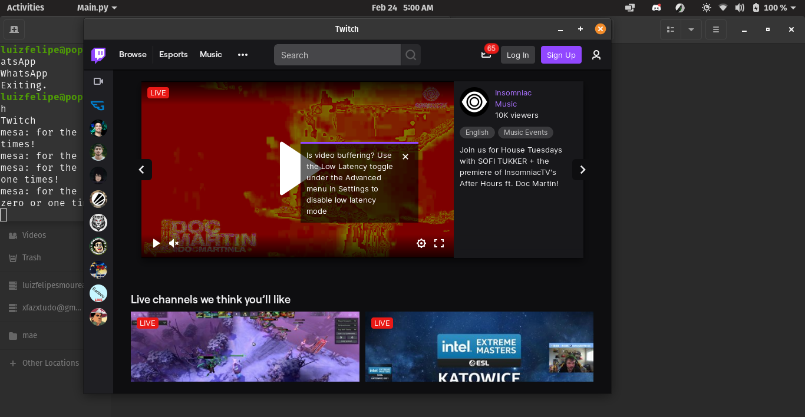

# Pynosh
Turn any Node.JS app or a website to a desktop app for better experience.
### Pyno.. what?!
It's a mix of Python, Node and Bash. Pynosh is a simple tool that will help you creating multiplatform Node.JS applications using Python and Bash code with WebViews.
## Screenshots

## Getting started
You only need to set a few stuff up in the manifest.json file and then run the "run.sh" file.
#### Flags (Optional)
- #### -l:
  Changes manifest `folderPath` item and set it to your own. "L" stands for location  
   ##### Example:
        ./run.sh -l /home/$USER/project-folder
   ##### Default:
  The default value is the directory to the folder where it's located. 

 - #### -p:
   Changes manifest `port` item and set it to your own.  "P" stands for port.
   ##### Example:
        ./run.sh -p 8000
   ###### Default:
   The default value for the port is `3000`.  
 - #### -u:
   Changes manifest `url` item and set it to your own and set manifest `isLocal` to false.  "U" stands for URL.
   ##### Example:
        ./run.sh -u http://web.whatsapp.com
- #### -t:
   Changes manifest `windowTitle` item and set it to your own value.  "T" stands for Title.
   ##### Example:
        ./run.sh -u http://web.whatsapp.com -t WhatsApp

## Setting up
Pynosh uses JSON for its configuration: `manifest.json`, so you don't have to worry about it.

## Credits
[Me](https://www.linkedin.com/in/luiz-felipe-s-7539b7127/), Luiz Felipe Sousa Moureau Linhares
##### Libraries used:
- [PyWebView](https://github.com/r0x0r/pywebview)  

## License
  [Here](https://github.com/mococa/pynosh/blob/main/LICENSE)
